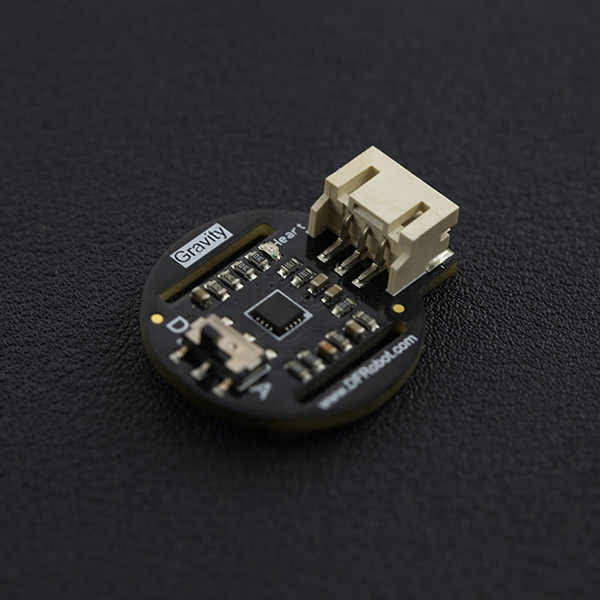

# DFRobot_Heartrate
* [English Version](./README.md)

DFRobot正式推出超小型心率传感器，采用光电容积脉搏波描记法(PhotoPlethysmoGraphy,PPG)，通过测量血液中血红蛋白随心脏跳动而对氧气吸收的变化量来测量人体心率参数。该方法拥有响应性快，性能稳定，适应性强等特点。模块拥有方波和脉搏波两种信号输出模式，可以通过板载开关去自由切换输出信号。脉搏波将输出一个连续的心率波形，而方波将根据心率的变化输出对应的方波。 新款心率传感器体积只有拇指大小，可以佩戴于手指、手腕、耳垂等皮肤裸露处。另外，板载的Gravity 3-Pin接口也可直接兼容Arduino I/O扩展板，使用简单，平台兼容性好，可广泛应用于手环，腕带等可穿戴饰品的DIY制作。




## 产品链接 (https://www.dfrobot.com.cn/goods-1339.html)
    SKU: SEN0203


## 目录

* [概述](#概述)
* [库安装](#库安装)
* [方法](#方法)
* [兼容性](#兼容性)
* [历史](#历史)
* [创作者](#创作者)


## 概述

* 该方法拥有响应性快，性能稳定，适应性强等特点。模块拥有方波和脉搏波两种信号输出模式，可以通过板载开关去自由切换输出信号。
* 脉搏波将输出一个连续的心率波形，而方波将根据心率的变化输出对应的方波。
* 新款心率传感器体积只有拇指大小，可以佩戴于手指、手腕、耳垂等皮肤裸露处。
* 另外，板载的Gravity 3-Pin接口也可直接兼容Arduino I/O扩展板，使用简单，平台兼容性好，可广泛应用于手环，腕带等可穿戴饰品的DIY制作。


## 库安装

这里有2种安装方法：
1. 使用此库前，请首先下载库文件，将其粘贴到\Arduino\libraries目录中，然后打开examples文件夹并在该文件夹中运行演示。
2. 直接在Arduino软件库管理中搜索下载 DFRobot_Heartrate 库


## 方法

```C++

    /**
     * @fn getRate
     * @brief Get heart rate value
     * @n Sample ten times in a row beating heart rate value is computed
     * @return Rate
     */
    uint16_t getRate(void);

    /**
     * @fn getCnt
     * @brief Get the current location
     * @return Current location
     */
    uint8_t getCnt(void);

    /**
     * @fn getValue
     * @brief Get a Sample values
     * @param pin - Communication pins
     * @return uint16_t
     */
    uint16_t getValue(uint8_t pin);

```


## 兼容性

MCU                | Work Well    | Work Wrong   | Untested    | Remarks
------------------ | :----------: | :----------: | :---------: | :----:
Arduino Uno        |      √       |              |             |
Arduino MEGA2560   |      √       |              |             |
Arduino Leonardo   |      √       |              |             |
FireBeetle-ESP8266 |      √       |              |             |
FireBeetle-ESP32   |      √       |              |             |
FireBeetle-M0      |      √       |              |             |
Micro:bit          |      √       |              |             |


## 历史

- 2022/04/26 - 1.0.0 版本


## 创作者

Written by linfeng(Musk.lin@dfrobot.com), 2022. (Welcome to our [website](https://www.dfrobot.com/))
