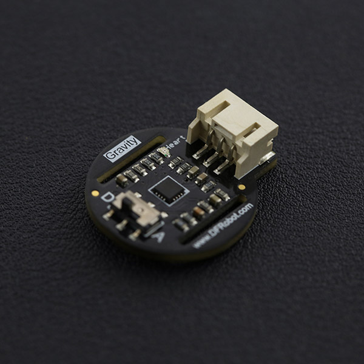

# DFRobot_Heartrate
* [中文版](./README_CN.md)

The DFRobot heart rate sensor is a thumb-sized heart rate monitor designed for Arduino microcontrollers. It includes a Gravity interface, for easy plug-and-play connectivity. This sensor is a pulse sensor which is developed based on PPG (PhotoPlethysmoGraphy) techniques. This is a simple and low-cost optical technique that can be used to detect blood volume changes in the microvascular bed of tissues. It is relatively easy to detect the pulsatile component of the cardiac cycle according to this theory. The sensor has two holes that you can use to attach to your belt. You can wrap on your finger, wrist, earlobe or other areas where it has contact with skin. The heart sensor has two kinds of signal output mode: analog pulse mode and digital square wave mode. You can change its output mode using the dial switch. There are many user scenarios, including education, sports or maker/interactive projects!




## Product Link (https://www.dfrobot.com/product-1540.html)
    SKU: SEN0203


## Table of Contents

* [Summary](#summary)
* [Installation](#installation)
* [Methods](#methods)
* [Compatibility](#compatibility)
* [History](#history)
* [Credits](#credits)


## Summary

* It includes a Gravity interface, for easy plug-and-play connectivity. 
* This sensor is a pulse sensor which is developed based on PPG (PhotoPlethysmoGraphy) techniques. 
* This is a simple and low-cost optical technique that can be used to detect blood volume changes in the microvascular bed of tissues. 
* It is relatively easy to detect the pulsatile component of the cardiac cycle according to this theory.


## Installation

There two methods: 
1. To use this library, first download the library file, paste it into the \Arduino\libraries directory, then open the examples folder and run the demo in the folder.
2. Search the DFRobot_Heartrate library from the Arduino Software Library Manager and download it.


## Methods

```C++

    /**
     * @fn getRate
     * @brief Get heart rate value
     * @n Sample ten times in a row beating heart rate value is computed
     * @return Rate
     */
    uint16_t getRate(void);

    /**
     * @fn getCnt
     * @brief Get the current location
     * @return Current location
     */
    uint8_t getCnt(void);

    /**
     * @fn getValue
     * @brief Get a Sample values
     * @param pin - Communication pins
     * @return uint16_t
     */
    uint16_t getValue(uint8_t pin);

```


## Compatibility

MCU                | Work Well    | Work Wrong   | Untested    | Remarks
------------------ | :----------: | :----------: | :---------: | :----:
Arduino Uno        |      √       |              |             |
Arduino MEGA2560   |      √       |              |             |
Arduino Leonardo   |      √       |              |             |
FireBeetle-ESP8266 |      √       |              |             |
FireBeetle-ESP32   |      √       |              |             |
FireBeetle-M0      |      √       |              |             |
Micro:bit          |      √       |              |             |


## History

- 2022/04/26 - Version 1.0.0 released.


## Credits

Written by linfeng(Musk.lin@dfrobot.com), 2022. (Welcome to our [website](https://www.dfrobot.com/))
